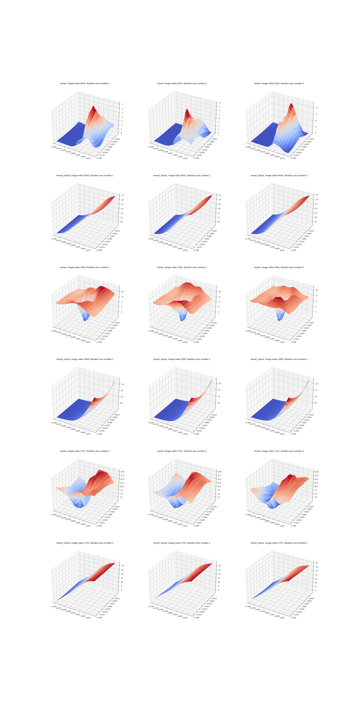

# 实验说明

## 基本信息

### 模型

* ReNet-20
* VGG-19
* DataParallel  
* Devices: [0,1,2,3]

### 数据集

* CIFAR10
* [512,3,32,32]  

### 损失函数

* CrossEntropyLoss
  
### 预处理

* RandomHorizontalFlip(),仅训练
* RandomCrop(32, 4),仅训练
* Normalize(mean=[0.485, 0.456, 0.406],std=[0.229, 0.224, 0.225])),训练与测试

## 标准训练  

### 模型名称

* resnet20
* vgg19

### 优化器

* SGD
* 轮数 = 250
* 学习率 = 0.1
* 权重衰退 = 1e-4
* 优化器计划: 100轮后学习率=0.01, 150轮后学习率=0.001
* 选出测试集精度(最)高的模型
  
### 测试集精度

* resnet20:   0.9000
* vgg19:  0.9201

## 对抗训练

### 对抗训练模型的名称

* resnet20_robust
* vgg19_robust

### PGD参数

* 步数 = 20
* $l_0$球体半径$\epsilon=8/255$  
* 步长$\alpha = 2*8/255/20$

### 对抗训练模型的优化器

* SGD
* 轮数=120
* 学习率=0.1
* 权重衰减 = 1e-4
* 优化器计划: 50轮后学习率0.01,80轮后学习率0.001
* 选出测试集精度(最)高的模型

### 对抗训练模型的测试集精度

* restnet20_robust:   0.8743
* vgg19_robust:   0.8418

### 对抗PGD的精度

* 同训练参数:$\epsilon = 8/255,\alpha = 2*8/255/20$
  * resnet20:   0.0136
  * resnet20_robust:    0.697
  * vgg:    0.2185
  * vgg_robust:   0.7414
* 参数放大一倍:$\epsilon = 16/255,\alpha = 2*2*8/255/20$
  * resnet20: 0.0
  * resnet20_robust:  0.5217  
  * vgg:   0.0624
  * vgg_robust:  0.5608

### 对抗FGSM的精度

* 同训练参数:$\epsilon = 8/255$
  * resnet20:0.2681
  * resnet20_robust:0.7073
  * vgg19:0.4337
  * vgg19_robust:0.7507
* 参数放大一倍:$\epsilon = 16/255$
  * resnet20:0.1878
  * resnet20_robust:0.5653
  * vgg19:0.2318
  * vgg19_robust:0.6108

## 标准训练模型与对抗训练模型的对比

### 关于图片的导数的可视化

* 第一行:原图片及其各通道  
* 第二行:resnet20_robust 关于图片的导数及其各通道  
* 第三行:resnet20关于图片的导数及其各通道
* 测试样本随机来源于测试集标号4670-4684,7900-7915,9900-9915

注意到经过对抗训练的模型的导数图像更具有类似原图的特征

### 关于损失函数的可视化

* 每幅图中,纵轴为损失函数值,水平面由图像的sign(梯度)方向与另一随机方向生成
* 每一行中不同的列对应不同的随机方向
* 每两行中
  * 第一行:resnet20
  * 第二行:resnet20_robust

确实可以看到经过对抗训练的模型的损失函数相对更加光滑平整,某种程度上更接近于线性

